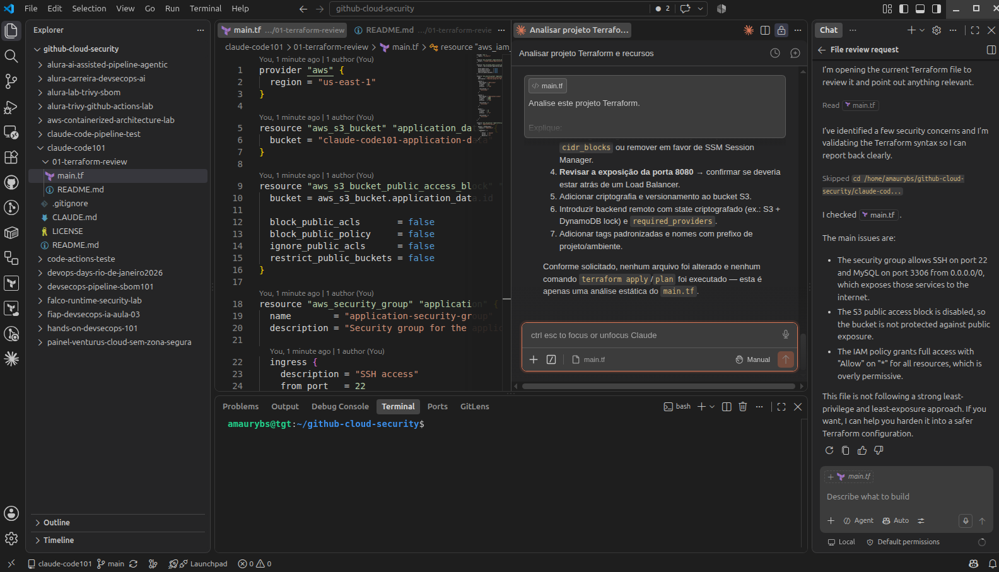

# Lab 01 — Terraform Review com Claude Code

Este laboratório demonstra como utilizar o **Claude Code** para entender e revisar um projeto Terraform existente.

O objetivo inicial não é modificar o código, mas utilizar a IA como apoio para compreender a arquitetura, identificar riscos e sugerir melhorias.

---



## Objetivos

Ao concluir este laboratório, você será capaz de:

- utilizar Claude Code para analisar arquivos Terraform;
- identificar recursos e dependências;
- encontrar configurações inseguras;
- entender riscos de Cloud Security;
- receber recomendações sem modificar o projeto.

---

## Arquivo analisado

```text
main.tf
```

O projeto contém exemplos propositalmente simplificados de:

- Amazon S3;
- AWS Security Groups;
- AWS IAM.

Algumas configurações inseguras foram adicionadas intencionalmente para fins educacionais.

---

## Prompt sugerido

Abra este diretório no seu editor com Claude Code e utilize:

```text
Atue como um Cloud Engineer com foco em Terraform e AWS.

Analise todos os arquivos .tf deste projeto.

Explique:

1. Quais recursos serão criados.
2. Como esses recursos se relacionam.
3. Quais dependências existem entre eles.
4. Possíveis riscos de segurança.
5. Más práticas de Terraform.
6. Melhorias recomendadas.

Para cada risco, informe:

- arquivo;
- recurso;
- severidade;
- explicação;
- recomendação.

Não altere nenhum arquivo.
Não execute terraform apply.
Não invente recursos que não existem no projeto.
```

---

## Resultado esperado

O Claude Code deverá identificar problemas como:

- Security Group permitindo SSH público;
- permissões IAM excessivas;
- proteção pública do S3 desabilitada;
- regras de rede excessivamente permissivas.

Também deverá explicar como os recursos declarados se relacionam.

---

## Próximo passo

Depois da análise inicial, experimente perguntar:

```text
Agora priorize somente os 3 riscos mais importantes e explique qual deveria ser corrigido primeiro.
```

Depois:

```text
Mostre como ficaria uma versão mais segura deste Terraform, mas não altere os arquivos.
```

---

## Importante

Este laboratório possui finalidade exclusivamente educacional.

Não execute `terraform apply` em uma conta AWS real sem revisar e adaptar os recursos.